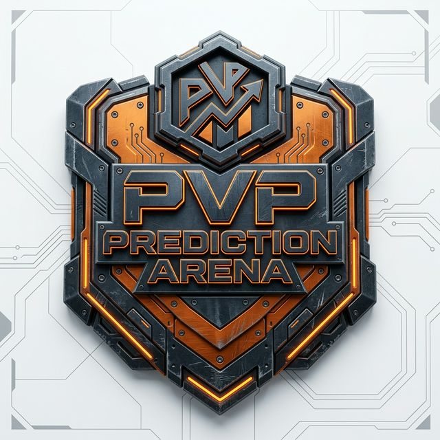

# PVP PREDICTION ARENA ⚡️



> **PREDICT. PLAY. WIN.**
> A decentralized, high-fidelity PvP prediction market powered by GenLayer's Intelligent Contracts.

---

## 🏛️ The Vision

**PVP PREDICTION ARENA** is the next evolution of social prediction markets. By leveraging GenLayer's Intelligent Contracts, we've eliminated the "house," the middlemen, and the ambiguity of manual settlement. Every game is a direct battle between players, with outcomes verified by a decentralized AI consensus.

- **100% Fair**: Results are machine-verifiable and cross-referenced by multiple AI models.
- **Direct Payouts**: Immutable smart contracts handle token distribution immediately upon event finalization.
- **Cyber-Industrial Aesthetic**: A neobrutalist interface designed for professional operators and casual players alike.

---

## 🛠️ Technology Stack

- **Blockchain**: [GenLayer](https://genlayer.com) — intelligent contracts on [Testnet Bradbury](https://docs.genlayer.com/developers/networks)
- **GenLayer RPC** (wallet + `gen_*` + forwarded `eth_*`): `https://rpc-bradbury.genlayer.com`
- **GenLayer Chain RPC** (underlying zkSync L2, same chain id): `https://rpc.testnet-chain.genlayer.com`
- **Chain ID**: `4221` · **Currency**: GEN · **Explorer**: [explorer-bradbury.genlayer.com](https://explorer-bradbury.genlayer.com) · **Faucet**: [testnet-faucet.genlayer.foundation](https://testnet-faucet.genlayer.foundation)
- **Deployed contract address**: `src/services/contract_address.js` (run `npm run deploy` to deploy and overwrite)
- **Contract source**: `/contracts` (Python / GenVM)
- **Smart Contracts**: Intelligent Contracts ([docs](https://docs.genlayer.com/developers/intelligent-contracts/introduction))

See **`docs/GENLAYER_BRADBURY.md`** in this repo for Bradbury architecture, RPC behavior, and troubleshooting.

**Cursor:** GenLayer skills marketplace + `.cursor/rules` setup → **`docs/CURSOR_GENLAYER.md`** ([skills.genlayer.com](http://skills.genlayer.com/)).

---

## 🏗️ Technical Architecture

### 1. Intelligent Contract v3.0.0
The arena core is a **GenLayer Skill-Compliant (v3.0.0)** Intelligent Contract. It implements authoritative safety patterns:
- **Equivalence Principle**: Uses `gl.eq_principle.prompt_comparative` to ensure validator consensus on non-deterministic LLM outputs.
- **LLM Resilience**: Enforces `response_format="json"` and utilizes robust regex-based JSON cleaning to handle varied LLM responses.
- **Error Classing**: Replaces standard exceptions with `gl.UserError`, using `[EXPECTED]` and `[LLM_ERROR]` prefixes for semantic clarity.


### 2. Judicial AI Protocol
The AI Judge uses a pedantic judicial prompt designed to verify real-world factual propositions through real-time search. It adheres to binary verdicts ("CHALLENGER" or "OPPONENT") to minimize ambiguity and ensure fair payouts.

---

## 🚀 Getting Started

### Prerequisites
- [Node.js](https://nodejs.org) (v18+)
- [MetaMask](https://metamask.io) (Configured for GenLayer Bradbury Testnet)
- [GenLayer CLI](https://docs.genlayer.com) (For contract interaction/deployment)

### Installation
1. Clone the repository:
   ```bash
   git clone https://github.com/your-username/pvp-prediction-arena.git
   cd pvp-prediction-arena
   ```
2. Install dependencies:
   ```bash
   npm install
   ```
3. Set up environment variables:
   Create a `.env` file in the root based on the provided configuration for your contract addresses.
4. Run the development server:
   ```bash
   npm run dev
   ```

---

## 📡 Deployment

### Contract (Bradbury)

```bash
npm run deploy              # deploy OracleDuel.py → writes src/services/contract_address.js
```

If deploy stalls or RPC errors appear after the GenLayer tx id is printed, use **`docs/GENLAYER_BRADBURY.md`** — in short: `npm run complete-deploy -- 0x<genlayer_tx_id>` or `npm run recover-deploy -- 0x<evm_tx_hash>`.

### GitHub
The repository is initialized and ready for a remote push. 
1. Link your remote: `git remote add origin YOUR_URL`
2. Push: `git push -u origin main`

### Vercel
The project includes a `vercel.json` for seamless SPA routing.
- Simply connect your GitHub repository to Vercel.
- The build command is `npm run build` and the output directory is `dist`.

---

## ⚖️ Game Rules

1. **Enter the Arena**: Select or create a game with a specific prediction.
2. **Bet GEN**: Lock your stake against another player.
3. **Verify Result**: Once the event concludes, any player can trigger the **AI Check**.
4. **Win Big**: The winner receives the combined stake automatically.

---

## 🛡️ License
Distributed under the MIT License. See `LICENSE` for more information.

---

**[ PVP PREDICTION ARENA ]** // SYSTEM_STATUS: OPERATIONAL
