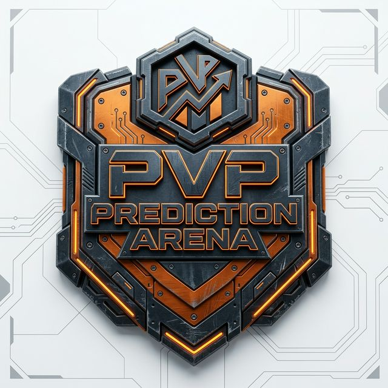

# ⚔️ PVP PREDICTION ARENA



> **PREDICT. STAKE. WIN.**
> A decentralized PvP prediction market powered by GenLayer's Intelligent Contracts and AI-driven resolution.

---

## 🏛️ Overview

**PVP Prediction Arena** is a fee-free, peer-to-peer prediction market where players stake GEN tokens on factual claims. A decentralized AI consensus network judges each duel — no middlemen, no house edge, no manual settlement.

- **100% Fair** — Results are machine-verified by multiple AI validator nodes reaching consensus.
- **Fee-Free** — Winners receive the entire pot. Zero platform fees.
- **Dual-Network** — Live on both GenLayer **StudioNet** and **Bradbury** testnets.
- **Instant or Timed** — Duels can resolve immediately (for current facts) or after a deadline (for future predictions).

---

## 🌐 Live Deployments

| Network | Chain ID | Contract Address | Explorer |
|---------|----------|-----------------|----------|
| **StudioNet** | `61999` | `0xaa9a0916a0795ae7105c5577c458591811104424` | [studio.genlayer.com](https://studio.genlayer.com) |
| **Bradbury** | `4221` | `0xD6243C1b01826e6E3f05e03C00624f960F594868` | [explorer-bradbury.genlayer.com](https://explorer-bradbury.genlayer.com) |

Contract addresses are configured in [`src/services/contract_address.js`](src/services/contract_address.js).

---

## 🛠️ Technology Stack

| Layer | Technology |
|-------|-----------|
| **Blockchain** | [GenLayer](https://genlayer.com) — Intelligent Contracts with built-in LLM execution |
| **Contract** | `contracts/OracleDuel.py` — GenVM v4, fee-free PvP with AI judge |
| **Frontend** | React + Vite, Framer Motion, Lucide icons |
| **Wallet** | RainbowKit + wagmi (MetaMask, WalletConnect, etc.) |
| **RPC** | `genlayer-js` SDK for `gen_call` / `gen_getTransactionByHash` |
| **Styling** | Neobrutalist design system with Space Grotesk + Inter |

### Network RPCs
- **StudioNet**: `https://studio.genlayer.com/api`
- **Bradbury**: `https://rpc-bradbury.genlayer.com`
- **Chain RPC** (underlying zkSync L2): `https://rpc.testnet-chain.genlayer.com`
- **Faucet**: [testnet-faucet.genlayer.foundation](https://testnet-faucet.genlayer.foundation)

---

## 🏗️ Architecture

### Intelligent Contract (`OracleDuel.py`)
The arena core is a **GenVM v4** Intelligent Contract implementing:

- **Fee-Free Payouts** — 100% of the staked pot goes to the winner.
- **AI Judge Protocol** — Uses `gl.nondet.exec_prompt()` with a pedantic judicial prompt that independently verifies factual claims against real-world data.
- **Validator Consensus** — `gl.vm.run_nondet_unsafe()` with a `validator_fn` that cross-checks the leader's verdict, ensuring multi-node agreement on winner determination.
- **1000-Character Reasoning** — The AI generates rich, sports-broadcaster-style commentary explaining each verdict.
- **Full Lifecycle** — `create_duel` → `match_duel` → `resolve_duel` (AI) → `claim_winnings`, with cancel/expire support.

### Frontend
- **Network Detection** — Automatically detects unsupported chains and triggers wallet `switchChain()` to StudioNet or Bradbury.
- **RPC Resilience** — Intelligent backoff and retry when GenLayer RPC returns "Server busy" or rate-limit errors.
- **Transaction Journey** — Real-time 5-step progress tracker showing submission → activation → proposal → voting → finalization.
- **Leaderboard** — On-chain win/loss stats aggregated from resolved duels.

---

## 🚀 Getting Started

### Prerequisites
- [Node.js](https://nodejs.org) v18+
- [MetaMask](https://metamask.io) configured for GenLayer (StudioNet or Bradbury)
- [GenLayer CLI](https://docs.genlayer.com) (optional, for contract deployment)

### Installation
```bash
git clone https://github.com/AshThunder/pvpprediction.git
cd pvpprediction
npm install
```

### Run Development Server
```bash
npm run dev
```
Opens at `http://localhost:5173`. Connect your wallet to StudioNet (`61999`) or Bradbury (`4221`).

---

## 📡 Deployment

### Contract Deployment
```bash
# Deploy to StudioNet (default)
genlayer contracts deploy contracts/OracleDuel.py --password deploy123

# Deploy to Bradbury
genlayer network set bradbury
genlayer contracts deploy contracts/OracleDuel.py --password deploy123
```

Update `src/services/contract_address.js` with the new contract address after deployment.

### E2E Simulation
Run the full duel lifecycle test across both networks:
```bash
node simulate_duels.js
```
This creates duels, matches them, triggers AI resolution, and claims winnings — verifying the entire flow end-to-end.

### Vercel
The project includes `vercel.json` for seamless SPA routing.
- Connect your GitHub repository to Vercel.
- Build command: `npm run build` · Output directory: `dist`

---

## ⚖️ How It Works

```
┌─────────────┐    ┌─────────────┐    ┌─────────────┐    ┌─────────────┐
│  1. CREATE   │───▶│  2. MATCH    │───▶│  3. RESOLVE  │───▶│  4. CLAIM    │
│  Stake GEN   │    │  Counter it  │    │  AI judges   │    │  Winner paid │
│  on a claim  │    │  with facts  │    │  the facts   │    │  full pot    │
└─────────────┘    └─────────────┘    └─────────────┘    └─────────────┘
```

1. **Create a Duel** — Post a verifiable claim and stake GEN tokens. Set an instant or timed deadline.
2. **Match the Duel** — An opponent stakes the same amount with their counter-evidence.
3. **AI Resolution** — Anyone can trigger the AI Check once the deadline passes. GenLayer's decentralized AI network evaluates the claim using real-world knowledge, producing a binary verdict with entertaining commentary.
4. **Claim Winnings** — The winner collects the entire pot. No fees deducted.

---

## 📂 Project Structure

```
pvpprediction/
├── contracts/
│   └── OracleDuel.py          # GenVM v4 Intelligent Contract
├── src/
│   ├── components/
│   │   ├── Arena.jsx           # Main game board (duels, actions, leaderboard)
│   │   ├── Home.jsx            # Landing page
│   │   ├── About.jsx           # How-it-works page
│   │   ├── Avatar.jsx          # Deterministic wallet avatars
│   │   ├── ActivityFeed.jsx    # Live event ticker
│   │   └── Toast.jsx           # Notification system
│   ├── services/
│   │   ├── genlayer.js         # GenLayer client factory (StudioNet/Bradbury)
│   │   ├── contract_address.js # Production contract addresses
│   │   └── abi.js              # Contract ABI
│   └── main.jsx                # App entry + RainbowKit/wagmi config
├── simulate_duels.js           # E2E test suite (6 topics, both networks)
├── index.html                  # Entry point with ⚔️ favicon
└── vercel.json                 # SPA routing config
```

---

## 🛡️ License
Distributed under the MIT License. See `LICENSE` for more information.

---

**⚔️ PVP PREDICTION ARENA** · Live on GenLayer StudioNet & Bradbury · [github.com/AshThunder/pvpprediction](https://github.com/AshThunder/pvpprediction)
